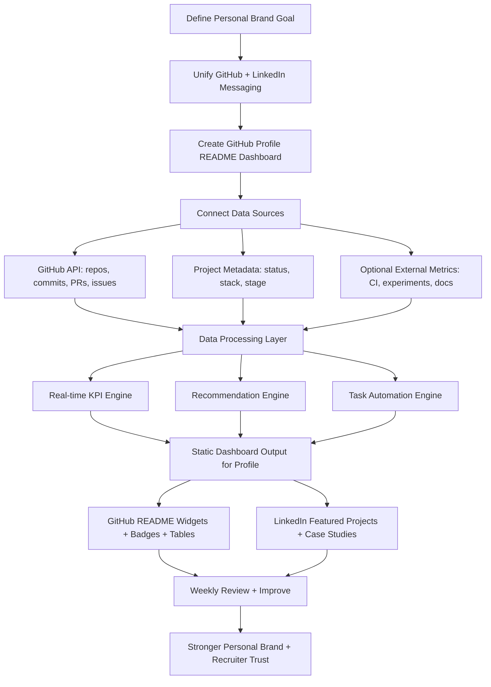

# Engineer-Style Personal Brand System

## 1) Vision
Build a **single identity system** across GitHub + LinkedIn that presents you as an engineer who:
- ships projects consistently,
- measures progress in real time,
- experiments with AI/ML,
- and automates repetitive work.

---

## 2) Brand Positioning (GitHub + LinkedIn)

### Core Theme
**"AI/ML Systems Engineer building autonomous project workflows."**

### Visual/Content Style
- Minimal dark theme + accent color (electric blue/green)
- Architecture diagrams, flowcharts, metrics cards
- Evidence-first writing (what problem, what stack, what result)

### Tagline Ideas
- "Engineering intelligent systems from idea to automation"
- "Building measurable AI/ML workflows"
- "From prototypes to autonomous project operations"

---

## 3) End-to-End Flowchart

---

## 4) System Architecture (Dashboard Concept)

### Layer A — Data Ingestion
Collect project-level data:
- Repository name, domain, status, priority
- Last commit date, commit frequency, open issues, PR cycle time
- Stack usage (Python, JS, TensorFlow, PyTorch, etc.)
- Project stage: Idea → POC → MVP → Production

### Layer B — Metrics + Analytics
Generate metrics that show engineering maturity:
- Delivery velocity (commits/week)
- Completion ratio (done tasks / total tasks)
- Reliability indicators (CI pass rate)
- Learning indicators (new ML topics integrated/month)

### Layer C — Intelligence (AI/ML)
- **Recommendation model**: suggests next best task by urgency + impact
- **Risk model**: flags stalled projects based on inactivity patterns
- **Content assistant**: drafts weekly progress summary for README + LinkedIn
- **Skill-gap detector**: compares project goals vs current stack coverage

### Layer D — Automation
- Auto-update dashboard daily/weekly via GitHub Actions
- Auto-generate changelog snippets and progress cards
- Auto-prioritize tasks in project board

### Layer E — Presentation
- GitHub profile README as your **static command center**
- LinkedIn Featured section mirrors top 3 high-impact projects
- Monthly engineering report post on LinkedIn

---

## 5) GitHub Profile Enhancement Blueprint

### Required Elements (Profile README)
1. **Header block**: role + mission + location/timezone.
2. **Live stats area**: repos, commits, contribution streak, top languages.
3. **Project command table**:
   - Project
   - Stage
   - Current focus
   - Health score
   - Last update
4. **Now Working On** section (auto-refreshed).
5. **AI/ML experiments** section:
   - active hypotheses,
   - current dataset,
   - baseline vs latest result.
6. **Roadmap** (30/60/90 days).

### Optional Advanced Elements
- Mini architecture images per flagship project
- "System health" badges (build/data/model/version)
- Personal API endpoint that outputs JSON for README rendering

---

## 6) LinkedIn Enhancement Blueprint

### Profile Sections to Upgrade
- **Headline**: role + specialization + outcomes.
- **About**: 5-part structure:
  1) what you build,
  2) domains,
  3) tools,
  4) measurable impact,
  5) collaboration interest.
- **Featured**: dashboard repo, top 2 projects, one case-study post.
- **Experience**: convert tasks into engineering outcomes with metrics.
- **Skills**: pin 15 relevant, grouped by:
  - Core engineering,
  - Data/ML,
  - MLOps/automation.

### Weekly LinkedIn Content Loop
- Monday: build log (what you are implementing)
- Wednesday: technical breakdown (architecture/decision)
- Friday: result post (metrics, demo, next step)

---

## 7) Functional Requirements (Your Requested Dashboard)

### FR-1 Unified Project Registry
- The system must track all projects in one structured source (YAML/JSON/DB).

### FR-2 Real-Time Statistical Measurement
- The system must calculate and expose near-real-time metrics for each project.

### FR-3 Autonomous Task Handling
- The system should recommend and optionally trigger repetitive maintenance actions.

### FR-4 Multi-Project Monitoring
- The system must display status of all projects simultaneously.

### FR-5 AI/ML Insight Layer
- The system should provide prediction/recommendation outputs from simple models first, then improve over time.

### FR-6 Publish to GitHub + LinkedIn
- The system must generate publish-ready summaries for both platforms.

---

## 8) Non-Functional Requirements
- **Reliability**: dashboard update job success rate > 95%
- **Performance**: rendering output under 3 seconds for profile data generation
- **Scalability**: support at least 50 active projects
- **Security**: tokens via GitHub Secrets only
- **Maintainability**: modular scripts + clear data schema

---

## 9) Implementation Plan (Step-by-Step)

### Phase 1 — Foundation (Week 1)
1. Define brand statement and visual style guide.
2. Build GitHub Profile README v1.
3. Standardize project metadata schema (`projects.yml`).
4. Add GitHub Action for scheduled update.

### Phase 2 — Dashboard Core (Week 2)
1. Build ingestion scripts (GitHub API + local metadata).
2. Compute KPIs (velocity, health, completion).
3. Render markdown dashboard blocks.
4. Integrate into README.

### Phase 3 — AI/ML Layer (Week 3)
1. Add task recommendation logic (rule-based first).
2. Add inactivity risk scoring.
3. Add summary generation template for weekly reports.
4. Create AI/ML experiment cards in README.

### Phase 4 — LinkedIn Systemization (Week 4)
1. Rewrite headline/about/featured with unified messaging.
2. Publish one flagship architecture post.
3. Start weekly 3-post cadence.
4. Track impressions, profile visits, and inbound opportunities.

---

## 10) Suggested Tech Stack
- **Data**: GitHub GraphQL/REST APIs
- **Processing**: Python (pandas, pydantic)
- **Automation**: GitHub Actions (cron)
- **Storage**: YAML/JSON initially, SQLite later
- **Visualization**: Shields.io badges + generated SVG/Markdown tables
- **ML/AI**:
  - baseline: rule engine + scoring model,
  - advanced: lightweight classification/regression for prioritization.

---

## 11) KPI Dashboard Template
Track these KPIs every week:
- Active projects
- Projects moved stage this week
- Avg commit frequency/project
- Open issues aging > 14 days
- PR merge lead time
- Model/experiment improvement delta
- Learning hours invested in new concepts

---

## 12) First Deliverables You Can Build Immediately
1. `profile README` with dashboard scaffold
2. `projects.yml` registry for all projects
3. `metrics.py` script to compute progress + health score
4. `render_readme.py` script to update dashboard section
5. `github-actions.yml` scheduler for auto-refresh
6. `linkedin_weekly_template.md` for consistent posting

---

## 13) Practical "Engineer Look" Checklist
- Use diagrams over long text
- Show measurable outcomes in every project entry
- Keep naming conventions strict and consistent
- Include versioning and changelog discipline
- Demonstrate automation everywhere possible
- Show iterative improvement (baseline → optimized)

---

## 14) Start Now: GitHub Enhancement Actions (Step-by-Step)

Use this as your first execution checklist.

### Action 1 — Create/Upgrade Your GitHub Profile README (Day 1)
1. Create a special repo named exactly your username (example: `yourname/yourname`).
2. Add `README.md` with sections:
   - Engineer headline
   - Tech stack
   - Current focus
   - Featured projects
   - Contact links
3. Add one short mission statement:
   - "I build AI/ML engineering systems with measurable outcomes."

**Output required:** Profile README live on your GitHub profile.

### Action 2 — Build a Project Registry (Day 1)
1. In your main portfolio repo, create `projects.yml`.
2. Add every project with fields:
   - `name`
   - `stage` (idea/poc/mvp/prod)
   - `priority` (high/med/low)
   - `next_action`
   - `last_updated`

**Output required:** One structured file tracking all projects.

### Action 3 — Add a Dashboard Section in README (Day 2)
1. Add section `## Engineering Dashboard`.
2. Add a markdown table:
   - Project | Stage | Health | Next Action | Last Update
3. Fill with at least 3 real projects.

**Output required:** Static dashboard visible in README.

### Action 4 — Create Metrics Script (Day 2–3)
1. Create `scripts/metrics.py`.
2. Read data from `projects.yml`.
3. Compute:
   - active project count
   - stalled project count (`last_updated > 14 days`)
   - completion ratio
4. Save output to `generated/metrics.json`.

**Output required:** Auto-calculated measurable stats.

### Action 5 — Auto-Render README Block (Day 3)
1. Create `scripts/render_readme.py`.
2. Replace content between markers:
   - `<!-- DASHBOARD_START -->`
   - `<!-- DASHBOARD_END -->`
3. Inject updated dashboard table and KPI summary.

**Output required:** README updates from script, not manual edits.

### Action 6 — Automate with GitHub Actions (Day 4)
1. Create `.github/workflows/dashboard.yml`.
2. Run on schedule (daily) + manual trigger.
3. Workflow steps:
   - checkout
   - setup python
   - run `metrics.py`
   - run `render_readme.py`
   - commit changes if any

**Output required:** Dashboard refreshes automatically.

### Action 7 — Add AI/ML Starter Intelligence (Day 5)
1. Implement simple scoring rule:
   - score = `priority_weight + inactivity_risk + impact_weight`
2. Generate `Top 3 Next Actions` list.
3. Publish this list in README dashboard.

**Output required:** AI/ML-like recommendation behavior (rule-based v1).

### Action 8 — Add Engineering Credibility Signals (Day 6)
1. Add badges (CI status, Python version, license).
2. Add architecture diagram image for your top project.
3. Add measurable outcomes per project (latency, accuracy, throughput, etc.).

**Output required:** Strong engineer visual style and trust signals.

### Action 9 — Weekly Maintenance Routine (Every Sunday)
1. Archive completed tasks.
2. Update next week priorities.
3. Post weekly build summary to LinkedIn from dashboard data.
4. Track profile metrics (views, stars, recruiters reached).

**Output required:** Consistent growth loop.

### Minimum "Week-1 Done" Definition
- Profile README live
- Dashboard table with real data
- `projects.yml` complete
- Metrics generated automatically
- GitHub Action running
- Top-3 recommendations shown
